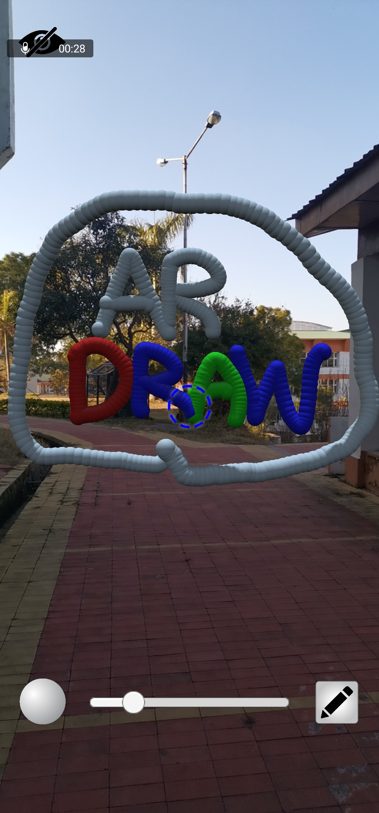

# ARDRAW

An application to draw 3D models in **mid-air**! Having uses in numerous
fields ranging from education to presentations.

This was created by Team **Dimensionauts** in [Electrothon-2020](https://www.google.com/url?sa=t&rct=j&q=&esrc=s&source=web&cd=3&cad=rja&uact=8&ved=2ahUKEwj56fqX2bLnAhWl6XMBHaEBBrwQFjACegQIAxAB&url=https%3A%2F%2Fnith.ac.in%2Fspec%2Fhackathon.html&usg=AOvVaw3BorhXbp4gYngNL9P_BSlN)

## Tech Stack
- [Unity](https://unity.com) (Game Engine - Community Edition - Free)

**Libraries**
- [AR Core](https://developers.google.com/ar)

## Building
Go to build settings and build the project don't forget to switch to
android platform first.
